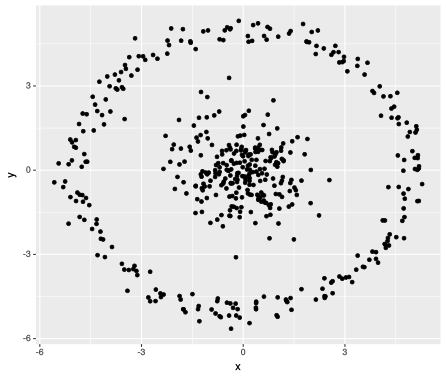
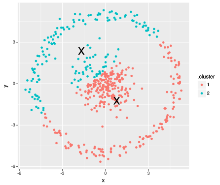
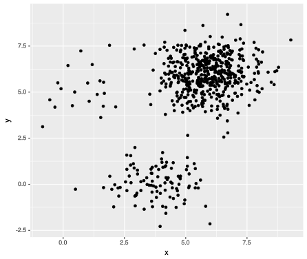
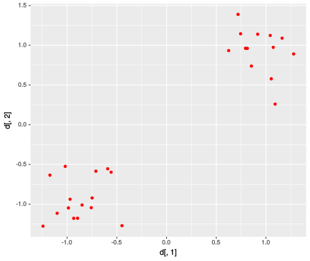
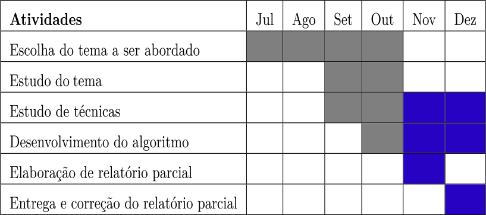

---
title       : Um teste para verificar a significância de clusters
subtitle    : Projeto de Pesquisa - TCC I
author      : Allan Vieira
job         : Orientador - Prof. Dr. André Cançado
framework   : io2012        # {io2012, html5slides, shower, dzslides, ...}
highlighter : highlight.js  # {highlight.js, prettify, highlight}
hitheme     : tomorrow      # 
widgets     : [mathjax, quiz, bootstrap, interactive] # {mathjax, quiz, bootstrap}
ext_widgets : #{rCharts: [libraries/nvd3, libraries/leaflet, libraries/dygraphs]}
mode        : selfcontained # {standalone, draft}
knit        : slidify::knit2slides
logo        : est_logo.png
biglogo     : unb_big_logo.png
assets      : {assets: ../../assets}
--- .class #id

<style type="text/css">
body {background:grey transparent;
}
.quiz-option label{
  display: inline;
  font-size: 1em;
}
ul.nav li::before { content: ""; }  
ul.nav li{ font-size: 18px; line-height: 24px;}
</style>


## Sumário
<br>
<br>

1. Introdução

2. Objetivos

3. Metodologia

4. Resultados Preliminares

5. Cronograma

6. Referências

--- .segue bg:grey
# O problema de pesquisa ...

--- .class #id
## Introdução

> - .fragment Expressivo desenvolvimento das técnicas de clustering nas últimas décadas;
<br>
> - .fragment _"Hype"_ de _Machine Learning_;
<br>
<br>
> - .fragment `Mas...`
  - .fragment algoritmos $\rightarrow$ restrições:
  - .fragment "shape" dos dados `vs` algoritmo empregado
  - .fragment `definição a priori do número de clusters`
<br>
> - .fragment $\rightarrow$ `"Blinded by Science"!!`
<br>
<br>
> - .fragment Muitos algoritmos de clustering `vs` poucos métodos de verificação do `k`
<br>
> - .fragment `Como determinar o número ideal de clusters?`


--- .class #id
## Objetivos
<br>
<br>
> - Desenvolver um algoritmo para testar a significância de clusters;
<br>
<br>
> - Implementar o algoritmo em R e disponibilizá-lo através de um pacote;


<!-- --- &twocol  -->
<!-- ## Metodologia (1) -->

<!-- - inspiração: `Cubic Clustering Criterion (CCC)` -->

<!-- - Algoritmo: -->

<!-- *** =left -->

<!-- <p><center> -->
<!-- </center></p> -->

<!-- *** =right -->

<!-- <p><center> -->
<!-- </center></p> -->


--- {class: class, tpl: tabs}

## Metodologia (1)

*** {class: active, id: kmeans}
Algumas restrições:

<!-- - _shape_ dos clusters; -->
<!-- - tamanhos diferentes em cada cluster; -->

<p>







<!-- <p> -->
<!-- <span style="font-size:0.7em; float: left">Baseado no conteúdo de:  -->
<!-- <a href="http://varianceexplained.org/r/kmeans-free-lunch/">http://varianceexplained.org/r/kmeans-free-lunch/</a> -->
<!-- </span> -->
<!-- </p> -->
</p>
<br>
<span style="font-size:0.7em; float: left">
Baseado no conteúdo de http://varianceexplained.org/r/kmeans-free-lunch/
</span>

<br>
<br>

> - .fragment $\rightarrow$ `No free lunch!!`


*** {id: left_right}
Funcionamento do kmeans:
<br>
<span style="font-size:0.7em; float: left">
(por Andrey A. Shabalin - http://shabal.in/)
</span>
<br>
<p>


</p>

*** {id: top_bottom}
<br>
<p>


</p>


--- .segue bg:grey
# O método proposto ...

--- .class #id
## Metodologia (2)

inspiração: `Cubic Clustering Criterion (CCC)`

<iframe src="./assets/widgets/hipercube_plotly.html" width=100% height=100% allowtransparency="true"> </iframe>


--- .class #id
## Metodologia (3)


<iframe src="./assets/widgets/withinss_cube_plotly.html" width=100% height=100% allowtransparency="true"> </iframe>


--- .segue bg:grey
# Alguns resultados ...

--- .class #id
<!-- --- .&twocol -->
## Resultados preliminares

<!-- *** =left -->


<!-- *** =right -->
```{r echo=FALSE}
#library(rCharts)
tablecode <- function(df, tabletype="gridtable"){
  tmp <- noquote(apply(df, 1, function(x) paste0("<td data-th='", sprintf("%s",colnames(df)), "'>", x, "</td>", collapse=" ")))
  
  cat(
    c(
      noquote(paste0("<table id='", tabletype,"' style='width:100%'> ")),    
      noquote(paste0("<tr>", paste0("<th>", sprintf("%s",colnames(df)), "</th>", collapse=" "), "</tr>")),
      noquote(unlist(lapply(tmp, function(x) paste0("<tr>", x, "</tr>")))),
      noquote("</table>")
    )
  )
}

tab <- data.frame("M"=rep(100,5), "n1" = c(32,15,50,50,100), "n2" = c(29,13,65,65,80),
                  "mean1"=c(-3, rep(-1,4)), "mean2"=rep(1,5), "sd1"=c(.4,.3,1,.7,.5),
                  "sd2"=c(.4,.3,1,.7,.7), "acerto"=c('TRUE', 'TRUE', 'FALSE', 'TRUE', 'TRUE'))
```


```{r, results='asis', echo=FALSE}
tablecode(tab, tabletype="onecol")
```
<br>
<p>





</p>

<!-- sol para imagens lado a lado: https://owlcation.com/stem/how-to-align-images-side-by-side -->


--- &twocol 
## Cronograma
<br>
<br>
*** =left
- 2S2017:
<p><center>
</center></p>

*** =right
- 1S2018:
<p><center>
</center></p>

--- .class #id
## Bibliografia

- [1] AUFFERMANN, W. F.; NGAN, S. C.; HU, X. `Cluster significance testing using the bootstrap.` NeuroImage, v. 17, p. 583–591, 2002.

- [2] BOTTOMLEY, P.; NAIRN, A. `Blinded by science: The managerial consequences of inadequately validated cluster analysis solutions.` International Journal of Market Research, v. 46, n. 2, 2004.

- [3] FUENTES, C.; CASELLA, G. `Testing for the existence of clusters.` p. 115–157, Jul 2009. Sort (Barc). 33(2).

- [4] HALKIDI Y. BATISTAKIS, M. V. M. `On clustering validation techniques. Journal of Intelligent Information Systems`, v. 17, n. 2/3, p. 107–145, 2001.

- [5] SAS Institute Inc., `Cubic Clustering Criterion.` 1983. SAS Technical Report A-108. Cary,
NC: SAS Institute Inc., 1983, 56 pp.

<!-- - [5] HANDL, J.; KNOWLES, J. `An evolutionary approach to objective clustering.` IEEE Transactions on Evolutionary Computation, v. 11, n. 1, Feb 2007. 2 -->

<!-- - [5] LIU, Y. et al. `Statistical significance of clustering for high-dimension, low-sample size data.` Journal of the American Statistical Association, v. 103, n. 483, p. 1281–1293, Sep 2008. 1 -->


--- .segue bg:grey

# Obrigado!!

<!-- como colocar figuras ao lado de palavras varias vezes em html -->
<div>
    <p>Feito no
     com 
    ,
     e
     !! </p>
</div>

Códigos e apresentação disponíveis noem:
<br>
<p>
<a href="http://github.com/allanvc/" style="color:black">http://github.com/allanvc/</a>
</p>

<p>
<a href="http://allanvc.github.io/apres_TCC1/" style="color:black">http://allanvc.github.io/apres_TCC1/</a>
</p>

