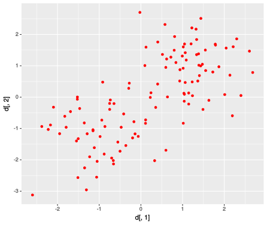
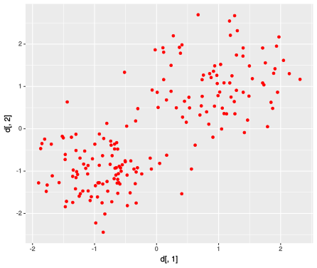

---
title       : Um teste para verificar a significância de clusters
subtitle    : Projeto de Pesquisa - TCC I
author      : Allan Vieira
job         : 14/0128492
framework   : io2012        # {io2012, html5slides, shower, dzslides, ...}
highlighter : highlight.js  # {highlight.js, prettify, highlight}
hitheme     : tomorrow      # 
widgets     : [mathjax, quiz, bootstrap, interactive] # {mathjax, quiz, bootstrap}
ext_widgets : #{rCharts: [libraries/nvd3, libraries/leaflet, libraries/dygraphs]}
mode        : selfcontained # {standalone, draft}
knit        : slidify::knit2slides
logo        : est_logo.png
biglogo     : unb_big_logo.png
assets      : {assets: ../../assets}
--- .class #id

## Sumário
 
 
1. Introdução

2. Objetivos

3. Metodologia

4. Resultados Preliminares

5. Cronograma

6. Referências

--- .segue bg:grey
# O problema de pesquisa ...

--- .class #id
## Introdução

> - .fragment Expressivo desenvolvimento das técnicas de clustering nas últimas décadas;
 
> - .fragment Real avanço científico;
 
> - .fragment _"Hype"_ de _Machine Learning_;
 
> - .fragment `Mas...`
  - .fragment Algoritmos $\rightarrow$ restrições:
  - .fragment "shape" dos dados `vs` algoritmo empregado
  - .fragment Definição a priori do número de clusters
 
> - .fragment $\rightarrow$ `"Blinded by Science"!!`
 
> - .fragment Muitos algoritmos de clustering `vs` poucos métodos de verificação de k
 
> - .fragment `Como determinar o número ideal de clusters?`

--- .class #id
## Objetivos

 
 
 
 
- Desenvolver um algoritmo para testar a significância de clusters;
 
 
 
 
 
- Implementar o algoritmo em R e disponibilizá-lo através de um pacote;

--- .segue bg:grey
# O algoritmo ...

--- &twocol 
## Metodologia (1)

- `Cubic Clustering Criterion (CCC)` & `probabilidade`

- Algoritmo:

*** =left

*** =right

--- .class #id
## Metodologia (2)

<iframe src="./assets/widgets/hipercube_plotly.html" width=100% height=100% allowtransparency="true"> </iframe>

--- .segue bg:grey
# Alguns resultados ...

--- .class #id
<!-- --- .&twocol -->
## Resultados preliminares

<!-- *** =left -->

<!-- *** =right -->

<table id='onecol' style='width:100%'>  <tr><th>M</th> <th>n1</th> <th>n2</th> <th>mean1</th> <th>mean2</th> <th>sd1</th> <th>sd2</th> <th>acerto</th></tr> <tr><td data-th='M'>100</td> <td data-th='n1'> 32</td> <td data-th='n2'>29</td> <td data-th='mean1'>-3</td> <td data-th='mean2'>1</td> <td data-th='sd1'>0.4</td> <td data-th='sd2'>0.4</td> <td data-th='acerto'>TRUE</td></tr> <tr><td data-th='M'>100</td> <td data-th='n1'> 15</td> <td data-th='n2'>13</td> <td data-th='mean1'>-1</td> <td data-th='mean2'>1</td> <td data-th='sd1'>0.3</td> <td data-th='sd2'>0.3</td> <td data-th='acerto'>TRUE</td></tr> <tr><td data-th='M'>100</td> <td data-th='n1'> 50</td> <td data-th='n2'>65</td> <td data-th='mean1'>-1</td> <td data-th='mean2'>1</td> <td data-th='sd1'>1.0</td> <td data-th='sd2'>1.0</td> <td data-th='acerto'>FALSE</td></tr> <tr><td data-th='M'>100</td> <td data-th='n1'> 50</td> <td data-th='n2'>65</td> <td data-th='mean1'>-1</td> <td data-th='mean2'>1</td> <td data-th='sd1'>0.7</td> <td data-th='sd2'>0.7</td> <td data-th='acerto'>TRUE</td></tr> <tr><td data-th='M'>100</td> <td data-th='n1'>100</td> <td data-th='n2'>80</td> <td data-th='mean1'>-1</td> <td data-th='mean2'>1</td> <td data-th='sd1'>0.5</td> <td data-th='sd2'>0.7</td> <td data-th='acerto'>TRUE</td></tr> </table>
 

<!-- sol para imagens lado a lado: https://owlcation.com/stem/how-to-align-images-side-by-side -->

--- &twocol 
## Cronograma
 
 
*** =left
- 2S2017:

*** =right
- 1S2018:

--- .class #id
## Obrigado!!

- [1] AUFFERMANN, W. F.; NGAN, S. C.; HU, X. `Cluster significance testing using the bootstrap.` NeuroImage, v. 17, p. 583–591, 2002. 1

- [2] BOTTOMLEY, P.; NAIRN, A. `Blinded by science: The managerial consequences of inadequately validated cluster analysis solutions.` International Journal of Market Research, v. 46, n. 2, 2004. 1

- [3] FUENTES, C.; CASELLA, G. `Testing for the existence of clusters.` p. 115–157, Jul 2009. Sort (Barc). 33(2). 1

- [4] HALKIDI Y. BATISTAKIS, M. V. M. `On clustering validation techniques. Journal of Intelligent Information Systems`, v. 17, n. 2/3, p. 107–145, 2001. 1

- [5] SAS Institute Inc., `Cubic Clustering Criterion.` 1983. SAS R Technical Report A-108. Cary,
NC: SAS Institute Inc., 1983, 56 pp. 2

<!-- - [5] HANDL, J.; KNOWLES, J. `An evolutionary approach to objective clustering.` IEEE Transactions on Evolutionary Computation, v. 11, n. 1, Feb 2007. 2 -->

<!-- - [5] LIU, Y. et al. `Statistical significance of clustering for high-dimension, low-sample size data.` Journal of the American Statistical Association, v. 103, n. 483, p. 1281–1293, Sep 2008. 1 -->

